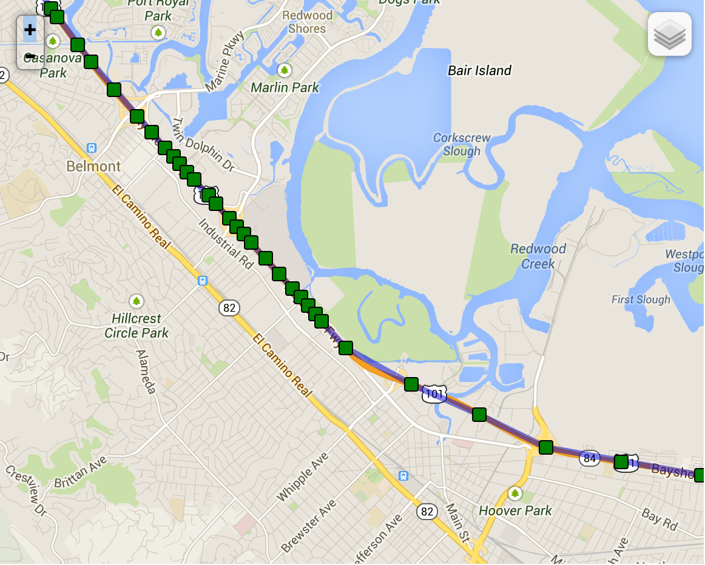
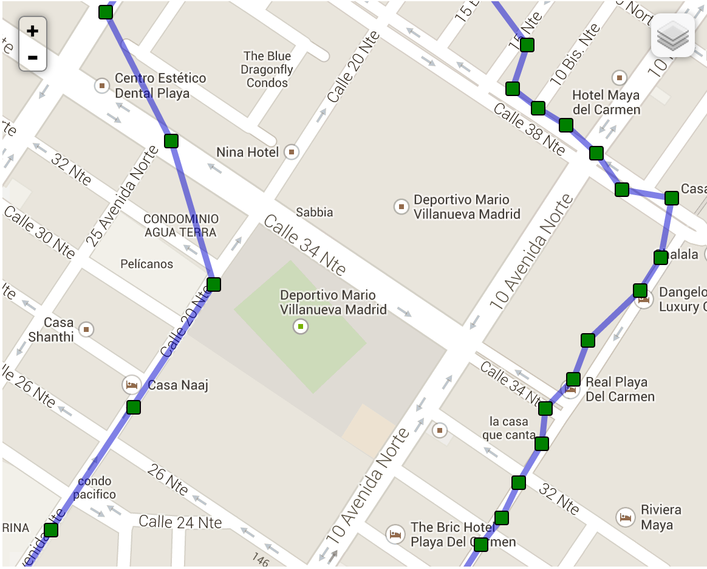

# Distance Filter Provider

This provider has features allowing you to control the behaviour of background-tracking, striking a balance between accuracy and battery-usage.  In stationary-mode, the plugin attempts to decrease its power usage and accuracy by setting up a circular stationary-region of configurable `stationaryRadius`. iOS has a nice system [Significant Changes API](https://developer.apple.com/library/ios/documentation/CoreLocation/Reference/CLLocationManager_Class/CLLocationManager/CLLocationManager.html#//apple_ref/occ/instm/CLLocationManager/startMonitoringSignificantLocationChanges), which allows the os to suspend your app until a cell-tower change is detected (typically 2-3 city-block change) Android uses [LocationManager#addProximityAlert](http://developer.android.com/reference/android/location/LocationManager.html).

When the plugin detects your user has moved beyond his stationary-region, it engages the native platform's geolocation system for aggressive monitoring according to the configured `desiredAccuracy`, `distanceFilter` and `locationTimeout`.  The plugin attempts to intelligently scale `distanceFilter` based upon the current reported speed.  Each time `distanceFilter` is determined to have changed by 5m/s, it recalculates it by squaring the speed rounded-to-nearest-five and adding `distanceFilter` (I arbitrarily came up with that formula.  Better ideas?).

`(round(speed, 5))^2 + distanceFilter`

## distanceFilter

is calculated as the square of speed-rounded-to-nearest-5 and adding configured #distanceFilter.

`(round(speed, 5))^2 + distanceFilter`

For example, at biking speed of 7.7 m/s with a configured distanceFilter of 30m:

`=> round(7.7, 5)^2 + 30`
`=> (10)^2 + 30`
`=> 100 + 30`
`=> 130`

A gps location will be recorded each time the device moves 130m.

At highway speed of 30 m/s with distanceFilter: 30,

`=> round(30, 5)^2 + 30`
`=> (30)^2 + 30`
`=> 900 + 30`
`=> 930`

A gps location will be recorded every 930m

Note the following real example of background-geolocation on highway 101 towards San Francisco as the driver slows down as he runs into slower traffic (geolocations become compressed as distanceFilter decreases)

Compare now background-geolocation in the scope of a city.  In this image, the left-hand track is from a cab-ride, while the right-hand track is walking speed.

**NOTE:** `distanceFilter` is elastically auto-calculated by the plugin:  When speed increases, distanceFilter increases;  when speed decreases, so does distanceFilter.
